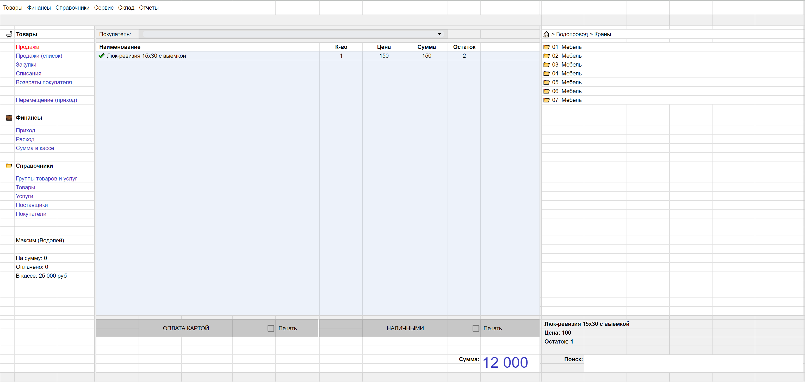

<div align="center"><h1>Vodolux-POS</h1> </div>

Просмотр :point_right:  [Vodolux-pos](https://balzak1976.github.io/vodolux-pos/)

**`!Приложение находится в разработке`**
<br>

Vodolux-POS - это приложение, для автоматизации рабочего места кассира.

### Проблемы, которые должно решить приложение
Основная причина недостачи и пересортицы на складе - ошибки продавца во время продажи.
Сведение к минимуму таких ошибок предназначен Vodolux-pos.
  
### Будущая функциональность
- отображение фотографии постоянных клиентов
- перетаскивание позиции в текущем чеке
- печать ценников на принтере чеков
- контроль единиц товара в набранном чеке
- улучшенный поиск товара
- редактирование штрихкода товара из текущего чека
- контроль и изменение остатков на складе

Начальный макет:




## Стэк технологий

| <a href="https://html.spec.whatwg.org/multipage/" target="_blank" rel="noreferrer"></a> | <a href="https://www.w3schools.com/css/" target="_blank" rel="noreferrer"></a> | <a href="https://www.typescriptlang.org/" target="_blank" rel="noreferrer"></a> | <a href="https://react.dev/" target="_blank" rel="noreferrer"></a> | <a href="https://redux-toolkit.js.org/" target="_blank" rel="noreferrer"></a>|
| :---: | :---: | :---: | :---: | :---: | 
| HTML | CSS  | TypeScript | React | Mantine UI kit |

<br>

## Запуск проекта

клонировать репозиторий 

```javascript
git clone https://github.com/Balzak1976/vodolux-pos.git
```

установить зависимости

```javascript
npm ci 
```
запуск проекта в режиме разработки ( адрес: `http://localhost:3000` )

```javascript
npm run start 
```
создать финальную сборку ( папка `build` )

```javascript
npm run build 
```